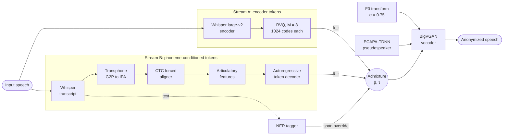

# Acoustic Token Admixture for Joint Speaker and Content Anonymization

[](#citation)
[](https://nijta.github.io/acoustic-token-admixture/)
[](LICENSE)

Official code and audio samples for the Interspeech 2026 paper
**"Acoustic token admixture for joint speaker and content anonymization"**.

Ali Golmakani<sup>1</sup>, Seyed Ahmad Hosseini<sup>1</sup>, Omar Manil Bendali<sup>1</sup>, Emmanuel Vincent<sup>1,2</sup>, Brij Mohan Lal Srivastava<sup>1</sup>
<br><sup>1</sup> Nijta SAS, France &nbsp; <sup>2</sup> Université de Lorraine, CNRS, Inria, LORIA, Nancy, France

**🔊 Listen to the samples: <https://nijta.github.io/acoustic-token-admixture/>** (source files are in [`docs/`](docs/))

---

## Overview

Speech recordings from healthcare, legal and enterprise settings leak identity
through two independent channels:

1. **Biometric**: the voice itself, which speaker verification (ASV) systems exploit.
2. **Linguistic**: named entities and stylometric cues in *what* is said.

Existing systems handle these separately and usually re-synthesize the whole
utterance. That discards the in-domain acoustics that make the data valuable
for training. This work handles both channels **inside a single acoustic token
space** and edits only the frames that need to change.

**Contributions**

- **Dual-stream RVQ admixture.** Encoder-derived tokens (Stream A) and phoneme-conditioned tokens (Stream B) are mixed per frame with probability β. A single vocoder then synthesizes the result, so no output is attributable to one subsystem.
- **NER-triggered frame-level replacement.** Frames aligned to a detected entity always take Stream B tokens, regenerated from the edited text. They are spliced back with an 8-frame crossfade, which keeps the surrounding prosody intact.
- **Cosine similarity gating.** A phoneme-derived token is accepted only if its reconstruction is close enough to the encoder's (τ = 0.6). This rejects tokens hallucinated from forced-alignment errors on noisy or accented speech.

**Headline result (VoicePrivacy 2024, β = 0.7):** EER **42.54%** (within one point of the challenge's top submission) with WER **3.73%**.

## Method



At each frame *t* the vocoder is conditioned on
`z_t = [ĥ_t ; f_t ; s*]` (1280 + 1 + 192 = 1473 dims): the continuous
reconstruction of the selected tokens, the transformed F0, and the pseudospeaker
x-vector.

### Where each paper component lives

| Paper (section) | Code |
|---|---|
| RVQ-Whisper tokens, Stream A (2.1.1) | [`rvqwhisper/src/rvqwhisper/__init__.py`](rvqwhisper/src/rvqwhisper/__init__.py) `RVQFasterWhisperWrapper.compute_bottleneck` |
| G2P, CTC alignment, articulatory features (2.1.2) | [`aligner/src/__init__.py`](aligner/src/__init__.py) `AlignerWrapper.get_articulatory_features` |
| Autoregressive token decoder, Stream B (2.1.2) | [`audiolm/`](audiolm/) `AudioLMWrapper.generate` |
| Frame-level admixture and cosine gate τ = 0.6 (2.2) | [`bigvgan/src/bigvgan/__init__.py`](bigvgan/src/bigvgan/__init__.py) `BigVGANWrapper.admixture(..., block_hallucination=True)` |
| NER-triggered content replacement, C = 8 frames (2.3) | [`content_editing.py`](content_editing.py) `apply_graft_replacement` |
| Pseudospeaker selection (2.4) | [`pspi/pseudospeaker.py`](pspi/pseudospeaker.py) `generate_pseudospeaker` |
| F0 transformation, α = 0.75 and additive noise (2.4) | `BigVGANWrapper.f0_transformation` |
| Vocoder (2.4) | `BigVGANWrapper.synthesize` |
| End-to-end pipeline | [`static_infer.py`](static_infer.py) |

## Results

**VoicePrivacy 2024** (EER: higher is better; WER: lower is better; UAR: higher is better)

| System | EER (%) | WER (%) | UAR (%) |
|---|:-:|:-:|:-:|
| Original speech | 10.2 | 1.8 | 70.1 |
| T12-5 (VPC 2024 top submission) | 43.23 | 4.56 | 37.83 |
| HLTCOE utterance-level admixture (p = 0.4) | 40.81 | 3.33 | 47.09 |
| Ours, β = 0.0 (no F0 transform) | 23.0 | 2.5 | 41.51 |
| Ours, β = 0.3 (no F0 transform) | 30.0 | 2.7 | 40.94 |
| **Ours, β = 0.7** | **42.54** | 3.73 | 40.11 |

**Speech editing** (213 utterances from *libri-test-asr* containing PERSON or LOCATION entities found by GLiNER)

| System | Anon. Sim ↓ | Edit Sim ↑ | WER (%) ↓ | MOS ↑ |
|---|:-:|:-:|:-:|:-:|
| Admixture only (β = 0.7, no NER) | 0.123 | n/a | 10.8 | 3.91 |
| Full system (NER + β = 0.7) | n/a | 0.959 | 11.9 | 3.84 |

*Anon. Sim* is the x-vector cosine similarity between the original and anonymized
speech. *Edit Sim* compares the anonymized source with its NER-edited version,
so it measures pseudospeaker consistency. MOS is predicted with wv-mos.

## Repository layout

```
.
├── static_infer.py         # single-process pipeline: anonymization + content replacement
├── static_infer_batch.py   # batch pipeline, parallel worker processes, β sweeps
├── static_infer_multi.py   # batch pipeline, N model copies x M threads (multi-GPU friendly)
├── content_editing.py      # graft splicing for NER span replacement (C = 8)
├── app.py                  # Gradio demo (anonymization only)
├── rvqwhisper/             # Whisper encoder + RVQ codebooks (LoRA fine-tuning code included)
├── aligner/                # G2P, CTC forced aligner, duration and F0 predictors
├── audiolm/                # phoneme-conditioned autoregressive RVQ token decoder
├── bigvgan/                # BigVGAN vocoder, admixture, F0 transform
├── pspi/                   # pseudospeaker pool, selection and pitch utilities
├── scripts/                # model download + release verification (timing, cost)
└── docs/                   # audio samples page (GitHub Pages)
```

## Installation

Requirements: Linux, Python 3.11, an NVIDIA GPU with CUDA.

```bash
git clone https://github.com/Nijta/acoustic-token-admixture.git
cd acoustic-token-admixture

python -m venv .venv && source .venv/bin/activate
pip install -r requirements.txt

# Make the local packages importable for inference
export PYTHONPATH=".:./audiolm:./bigvgan/src"
```

On first use, Whisper large-v2 (faster-whisper), the SpeechBrain ECAPA-TDNN
model and the Transphone G2P model are downloaded automatically.

## Model weights

The trained checkpoints and the pseudospeaker pool are on Hugging Face:
**[brijsri/acoustic-token-admixture](https://huggingface.co/brijsri/acoustic-token-admixture)**
(CC BY-NC 4.0, 1.8 GB with the French models and pool, 0.9 GB without).

```bash
scripts/download_models.sh models                 # English + French
ENGLISH_ONLY=1 scripts/download_models.sh models  # English only
export MODELS_DIR=$PWD/models
```

The script downloads with `hf download` and checks every file against
`SHA256SUMS`. The resulting layout is what the code expects in `$MODELS_DIR`
(default: `./models`):

```
models/
├── RVQWhisper/   config.yaml, rvq_model_en.pth, rvq_model_fr.pth
├── BigVGAN/      config.json, generator_english, generator_french
├── Aligner/      aligner_english.pth, aligner_french.pth, dur_predictor.pt, f0_predictor.pth
├── AudioLM/      config.yaml, audiolm_english.pt, audiolm_french.pt
├── POOL/english/ speaker pool: x-vectors, speaker-to-gender map, cluster indices, pitch statistics
└── POOL/french/  French speaker pool (optional)
```

The French checkpoints are optional and were not evaluated in the paper.

### Check your installation

`scripts/verify_release.py` runs the whole pipeline on a folder of wav files
and writes a PASS/WARN/FAIL report. It checks:

- the files, their checksums and the speaker pool;
- that the English and French checkpoints load;
- the three paper operating points: output sanity, speaker similarity to the source, and WER;
- speech editing and all three command-line tools.

```bash
python scripts/verify_release.py --inputs-dir my_wavs --out-dir verify_out
cat verify_out/report.md
```

Put a `<name>.json` file with `{"text": "..."}` next to each `<name>.wav` to
enable the WER checks.

## Usage

### 1. Anonymize a recording

```bash
python static_infer.py \
  --inputs input.wav \
  --output-dir outputs \
  --seeds 52 \
  --admixture-ratio 0.7 \
  --pitch-f 0.75 --db 2 \
  --gender any
```

This writes `outputs/anonymized_input.wav_seed_52.wav` and a timing breakdown
chart. The result name (`anonymized_input.wav_seed_52`) is what you pass to the
editing flags below.

| Flag | Meaning | Paper |
|---|---|---|
| `--admixture-ratio` | β, the probability of using a phoneme-derived token at each frame | 0.0, 0.3, **0.7** |
| `--pitch-f` | α in the F0 transform, the weight of the 32-frame voiced moving average (0 disables it) | 0.75 |
| `--db` | Level of the additive Gaussian noise on the F0 contour (0 disables it) | 2 |
| `--seeds` | One pseudospeaker per seed, comma separated. An empty string keeps the source speaker's x-vector | any |
| `--gender` | Gender of the pseudospeaker pool: `m`, `f`, or `any` (independent of the source) | `any` |
| `--spk-cluster` | `None` for the *random* strategy, `cluster_sparse` for the *sparse* strategy, or `cluster_dense`. The released pool has 7 female and 4 male clusters, fewer than the 10 the selector draws from, so `cluster_sparse` and `cluster_dense` currently pick from the same clusters | `None` or `cluster_sparse` |
| `--n-speaker` | Number of pool speakers averaged into the pseudospeaker | |

The cosine gate τ = 0.6 is fixed inside `BigVGANWrapper.admixture`.

**Regenerating the published samples.** All 16 speaker consistency clips on the
[samples page](https://nijta.github.io/acoustic-token-admixture/) are reproduced
(ECAPA similarity 0.79 to 0.94 to the published clip, mean 0.86) with:

```bash
python static_infer.py --inputs input.wav --output-dir out \
  --seeds 3358,4930,5192,5978 --gender m --spk-cluster cluster_dense --n-speaker 1 \
  --admixture-ratio 0.7 --pitch-f 0.75 --db 2
```

Replace `input.wav` with the page inputs (LibriSpeech speakers). Female-source clips
made with other settings are not part of the page.

**Paper operating points**

```bash
# β = 0.7, primary operating point (F0 transform on)
python static_infer.py --inputs in.wav --output-dir out --seeds 52 --gender any \
  --admixture-ratio 0.7 --pitch-f 0.75 --db 2

# β = 0.0 and β = 0.3 (F0 transform off, as in the paper)
python static_infer.py --inputs in.wav --output-dir out --seeds 52 --gender any \
  --admixture-ratio 0.3 --pitch-f 0 --db 0
```

### 2. Replace named entities (speech editing)

Each call runs the full pipeline and applies replacements to the result it has
just produced, so editing happens in the same call as anonymization. The word
indices come from the Whisper transcript and do not change between calls.

First list the word indices of a result:

```bash
python static_infer.py --inputs input.wav --output-dir outputs --seeds 52 \
  --admixture-ratio 0.7 --pitch-f 0.75 --db 2 --gender any \
  --print-words anonymized_input.wav_seed_52
```

Then replace spans by index. Consecutive indices form one group, and you give
one replacement phrase per group:

```bash
python static_infer.py --inputs input.wav --output-dir outputs --seeds 52 \
  --admixture-ratio 0.7 --pitch-f 0.75 --db 2 --gender any \
  --replace-result anonymized_input.wav_seed_52 \
  --replace-indices "3,4,12" \
  --replace-texts "David Jones, France" \
  --replace-out outputs/input_edited.wav
```

How it works: the replacement text is converted to articulatory features using
the surrounding transcript as phonetic context. Durations and F0 are predicted,
and the decoder generates new tokens. The generated chunk is extended by
C = 8 frames (about 160 ms) on each side and crossfaded into the anonymized
token stream (`content_editing.py`).

In the paper, the spans come from an NER tagger (GLiNER, PERSON and LOCATION).
This CLI takes word indices, so you can plug in any tagger.

### 3. Batch processing

```bash
# β sweep over a directory, 4 worker processes, keep data for later edits
python static_infer_batch.py \
  --input-dir /data/libri-test-asr --glob "*.flac" --recursive \
  --output-dir outputs/batch \
  --admixture-ratio "0,0.3,0.7" \
  --pitch-f 0.75 --db 2 \
  --workers 4 \
  --store-replacement-data
```

With `--seeds ""` and `--gender ""` (the defaults), every file gets a fresh
random pseudospeaker. Both batch scripts also accept `--print-words` and the
`--replace-*` flags; use a result name from the summary printed at the end of
the run. `static_infer_multi.py` has similar options and replaces `--workers`
with `--model-procs N --threads-per-model M`, which sets how many model copies
share the GPU(s). Run `--help` on either script for the full list.

> The cosine gate (τ = 0.6) is on by default in every script. Pass
> `--no-cosine-gate` to the batch scripts to turn it off, for example to
> measure its effect.
>
> The F0 transform in `static_infer_batch.py` applies to every β in the sweep.
> To match the paper's β = 0.0 and 0.3 rows, run those with `--pitch-f 0 --db 0`.

### 4. Gradio demo

```bash
python app.py
```

## Performance

Measured with `scripts/verify_release.py` on 20 LibriSpeech utterances
(4.3 to 8.6 s) on a single NVIDIA T4 (16 GB), PyTorch 2.3.1, one file at a
time. RTF is processing time divided by audio duration.

| Stage | Warm mean per file | RTF |
|---|--:|--:|
| Model loading (English, once) | 9.3 s | |
| Pitch extraction | 0.05 s | 0.009 |
| RVQ-Whisper tokens | 0.34 s | 0.059 |
| Whisper transcription | 1.45 s | 0.253 |
| G2P, alignment, articulatory features | 0.68 s | 0.118 |
| Stream B token generation | 8.72 s | 1.515 |
| Admixture | 0.13 s | 0.022 |
| BigVGAN synthesis | 1.18 s | 0.206 |
| **End to end** | **12.55 s** | **2.18** |
| Replace one word and resynthesize | 9.9 s | 2.10 |

Peak GPU memory was 5.7 GB. Autoregressive Stream B generation takes about
70% of the time; its cost is the same for every β, because the tokens are
generated before mixing.

## Training

Each component can be trained separately. The configuration files point at
local data manifests, so edit them before running.

| Component | Entry point | Notes |
|---|---|---|
| RVQ-Whisper | `PYTHONPATH=rvqwhisper/src python rvqwhisper/src/rvqwhisper_training/finetuning.py --config rvqwhisper/config.yaml` | Frozen Whisper large-v2 encoder, 8 x 1024 RVQ codebooks, LoRA (r = 32, α = 64) on q/v projections. See [`rvqwhisper/README.md`](rvqwhisper/README.md). |
| CTC aligner, duration and F0 predictors | `aligner/src/training.py`, `aligner/src/f0predictor.py` | See [`aligner/README.md`](aligner/README.md). |
| Token decoder | `audiolm/trainer.py` (`CoarseTransformerTrainer`) | Trained on *libri-train-clean-360* for 100k iterations (AdamW, peak lr 3e-4, batch 16). |
| BigVGAN | `bigvgan/src/bigvgan/train.py` | 800k iterations (batch 12, Adam β1 = 0.8, β2 = 0.99, lr 1e-4, decay 0.999996). Set `BIGVGAN_INIT_CKPT` and `RVQWHISPER_DIR`. The large LibriTTS `train-full.txt` filelist is omitted; regenerate it with `bigvgan/filelists/LibriTTS/parse_libritts.py` or take it from upstream BigVGAN. |
| Pseudospeaker pool | `pspi/pseudospeaker.py` (`Pool.load`) | ECAPA-TDNN x-vectors from held-out speakers, clustered with Affinity Propagation. |

The paper's training data covers Common Voice 17, LibriTTS *train-clean-100*,
VoxPopuli and VCTK. It is filtered with a MOS policy (wv-mos > 3.3,
< 10 min per speaker) or a speaker policy (10 min to 5 h per speaker).

## Evaluation

Privacy (EER, semi-informed attacker with ECAPA-TDNN retrained on anonymized
data), utility (WER with Whisper `medium.en`) and emotion (UAR on IEMOCAP)
follow the official
[VoicePrivacy Challenge 2024 toolkit](https://github.com/Voice-Privacy-Challenge/Voice-Privacy-Challenge-2024).
Anonymize the challenge data with `static_infer_batch.py`, then run the
toolkit's evaluation on the outputs.

## Limitations

- Emotion preservation (UAR 40.11%) is lower than utterance-level routing systems. The token decoder does not model emotional prosody.
- Content protection is limited by the recall of the NER tagger. Stylometric cues beyond named entities are only weakened by admixture, not removed.
- The released pipeline targets English.

## Responsible use

This system is meant to **protect** speakers in shared or reused recordings.
Please do not use it to impersonate people or to make synthetic speech look
like a real person's recording. Anonymized outputs can still contain
identifying information that the NER tagger missed, so review them before
you release data.

## Citation

```bibtex
@inproceedings{golmakani2026acoustic,
  title     = {Acoustic token admixture for joint speaker and content anonymization},
  author    = {Golmakani, Ali and Hosseini, Seyed Ahmad and Bendali, Omar Manil and Vincent, Emmanuel and Srivastava, Brij Mohan Lal},
  booktitle = {Proc. Interspeech 2026},
  year      = {2026}
}
```

## License and acknowledgements

The code in this repository is released under the [MIT License](LICENSE).
Parts of it are adapted from BigVGAN (NVIDIA), audiolm-pytorch (Phil Wang),
fairseq and IMS-Toucan. See [THIRD_PARTY_NOTICES.md](THIRD_PARTY_NOTICES.md)
for details and licenses.

Questions and issues are welcome on the
[issue tracker](https://github.com/Nijta/acoustic-token-admixture/issues).
For other enquiries, visit [nijta.com](https://nijta.com).
